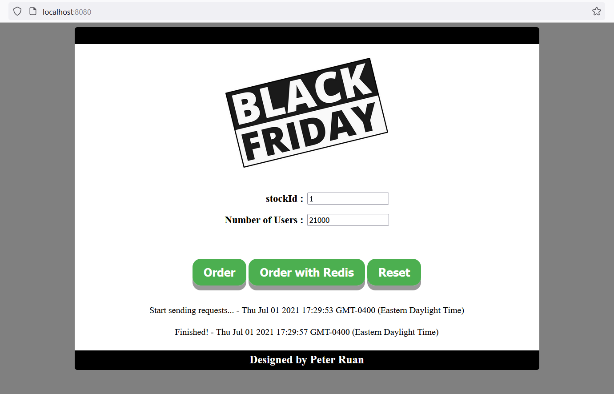
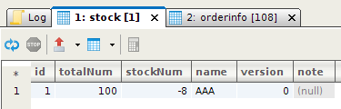
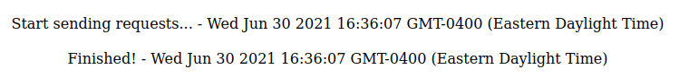
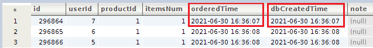
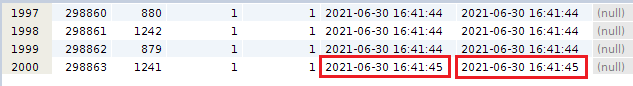
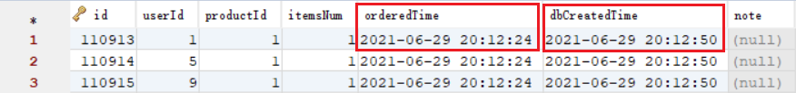
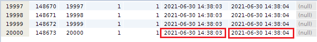

# Cyber Black Friday
Imagine that thousands of people is going to buy the same product at the same time during Cyber Black Friday, how Redis could help relieve the traffic jam of orders? In this project, I would test how efficient it would become when an online shopping system is integrated with Redis.

## Tools and frameworks
* Redis
* MySQL
* Maven
* Spring Boot
* Spring
* Spring MVC
* MyBatis

## How to run this project
1. Clone this project in `IntelliJ IDEA`;
2. Modify `/src/main/resources/application-dev.properties`:
    1. Modify `spring.datasource.username` and `spring.datasource.password` to your own MySQL username and password; 
    2. Modify `spring.datasource.url` and `blackfriday.database.url` to your current time zone;
3. Start your local Redis server;
4. Run `/src/main/java/com/singfung/blackfriday/CyberBlackFridayApplication`(click the triangle near the line numbers). After that, database `blackfriday` should have been created in your local MySQL;
5. Open `http://localhost:8080/` in Firefox. (p.s. If the Number of Users is too large, Chrome will show `Failed to load resource: net::ERR_INSUFFICIENT_RESOURCES`. So Chrome is not recommended in this project)

## Description
This project emulates the scene that a number of people are ordering the same product at the same time. Here are a few steps to follow:
1. Add a product into stock. In this step you need to decide the number of this product in stock. You can achieve this by doing one of the following:
    * Run `\api-examples\insert-stock-record.http` if you are using IntelliJ IDEA Ultimate;
    * Copy the content from `\api-examples\insert-stock-record.http` to Postman and run it.
2. Enter `stockId` (1 as default) and `Number of Users`;
3. Click one of the two buttons to start a emulation:
    * `Order`: implemented using pessimistic locking. IntelliJ Console will show `Orders are full!` when the stock is empty.
    * `Order with Redis`: implemented using Redis. All orders would be saved into Redis at first. When the stock in empty, orders would be transferred from Redis into MySQL. IntelliJ Console will show a message when the whole process is complete.
4. Check the database to see how much time was spent in the emulation.
5. Click `Reset` to clear all records in MySQL and Redis. Start another emulation by following all these steps again.

## Experiments
### Environment
* Ubuntu 18.04.4
* Redis 6.2.4
* MySQL 8.0.25
* Firefox

### Test cases
#### Case 1: No method is applied to prevent error

* parameters: stockNum = 100, number of users = 200
* result:

    

> Conclusion: Although there were only 100 products in stock, 108 orders were generated, which is definitely not accepted.

#### Case 2: Pessimistic locking

* parameters: stockNum = 2,000, number of users = 3,000
* results:

> Conclusion: It generated exactly 2,000 orders, however, it took more than 5 minutes to finish the whole process.

#### Case 3: Redis

* parameters: stockNum = 20,000, number of users = 21,000
* results:

> Conclusion: It generated exactly 20,000 orders, and it took only around 16s to finish the whole process.

   | Time of                                 | Time           |
   | :---                                    |     :---:      |
   | sending requests from browser           | ≈ 2s           |
   | generating orders in Redis              | ≈ 14s          |
   | transferring orders from Redis to DB    | ≈ 1s           |
   | the whole process                       | ≈ 16s          |

## Conclusion
Not only does Redis prevent the system from generating more orders, but it also helps decrease runtime significantly.

## Credit
* The main idea of this project is from a Chinese book called [Java EE 互联网轻量级框架整合开发](http://www.broadview.com.cn/book/80). However, I made a lot of improvement on it.
* The [Black Friday](https://scx2.b-cdn.net/gfx/news/hires/2017/blackfriday.jpg) image.