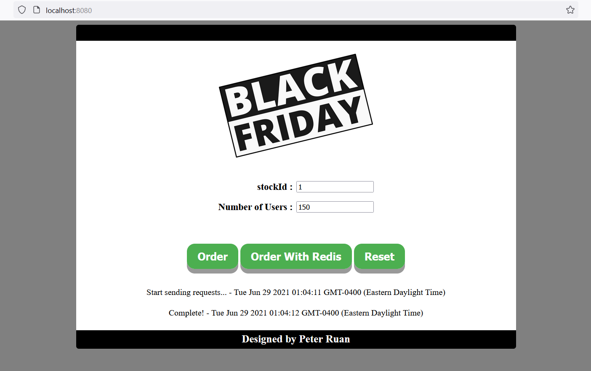

# Cyber Black Friday
Imagine that thousands of people would buy the same product at the same time during Cyber Black Friday, how Redis would help relieve the traffic jam of orders? In this project, 
I would test how efficient it would become when an online shopping system is integrated with Redis.

## Prerequisites
* Redis 3.2.100 or higher versions
* MySQL 8.0.15 or higher versions
* Maven 3.6.0 or higher versions
* Java 1.8

## Other frameworks
* Spring Boot
* Spring
* Spring MVC
* MyBatis

## How to run this project
1. Clone this project in `IntelliJ IDEA`;
2. Modify `/src/main/resources/application-dev.properties`:
    1. Modify `spring.datasource.username` and `spring.datasource.password` to your own MySQL username and password; 
    2. Modify `spring.datasource.url` and `blackfriday.database.url` to your current time zone;
3. Start your local Redis server;
4. Run `/src/main/java/com/singfung/blackfriday/CyberBlackFridayApplication`(click the triangle near the line numbers). After that, database `blackfriday` should have been created in your local MySQL;
5. Open `http://localhost:8080/` in Firefox. (p.s. If the Number of Users is too large, Chrome will show `Failed to load resource: net::ERR_INSUFFICIENT_RESOURCES`. So Chrome is not recommended in this project)

## Description
This project emulates the scene that a number of people are ordering the same product at the same time. Here are a few steps to follow:
1. Add a product into stock. In this step you need to decide the number of this product in stock. You can achieve this by doing one of the following:
    * Run `\api-examples\insert-stock-record.http` if you are using IntelliJ IDEA Ultimate;
    * Copy the content from `\api-examples\insert-stock-record.http` to Postman and run it.
2. Enter `stockId` (1 as default) and `Number of Users`;
3. Click one of the two buttons to start a emulation:
    * `Order`: implemented using pessimistic locking. IntelliJ Console will show `Orders are full!` when the stock is empty.
    * `Order with Redis`: implemented using Redis. All orders would be saved into Redis at first. When the stock in empty, orders would be transferred from Redis into MySQL. IntelliJ Console will show a message when the whole process is complete.
4. Check the database to see how much time was spent in the emulation.
5. Click `Reset` to clear all records in MySQL and Redis. Start another emulation by doing Step 1 again.

## Experiments
### Environment
### Result
#### Redis
1. stockNum = 20000, number of users = 21000:
    * Time of sending 21000 requests: around 6s
    
    * Time of saving 20000 orders into Redis: around 26s
    * Time of transferring 20000 orders from Redis to MySQL: around 3s
    
    
    * Generated exactly 20000 orders

#### Pessimistic Locking
1. stockNum = 1000, number of users = 2000:
    * Time of sending 1000 requests: around 1s
    
    * Time of saving 1000 orders one by one into MySQL: around 165s
    
    
    * Generated exactly 1000 orders
